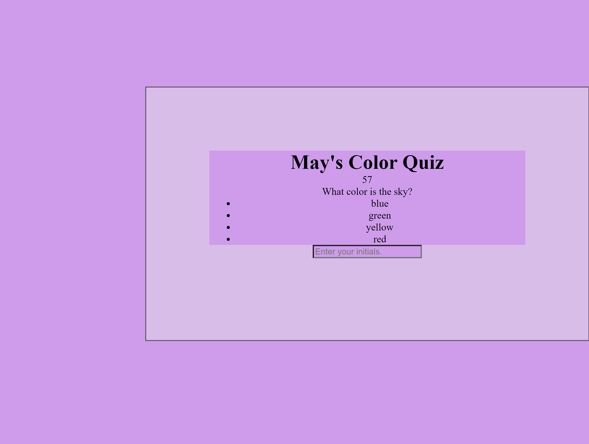

# code-quiz
Challenge 04 - Web APIs

## Description
The activity was created to showcase May Pham's skills, projects, and experiences while attending the UT Austin coding bootcamp. The purpose of this quiz site is to present a display of practices learned in Javascript, CSS, and HTML.

## Usage

https://mayphamx.github.io/maypham-code-quiz/
https://github.com/mayphamx/code-quiz